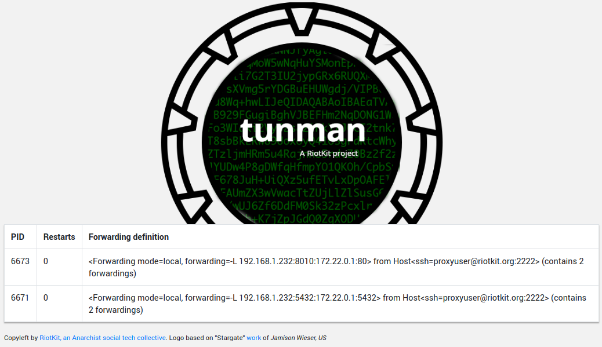

TunMan
======

[](https://codeclimate.com/github/riotkit-org/reverse-networking/maintainability)
[](https://codeclimate.com/github/riotkit-org/reverse-networking/test_coverage)
[](https://travis-ci.org/riotkit-org/reverse-networking)

Network setup automation and supervising. Provides monitoring, health checking, validating the connection with custom Python methods.

**Super-elastic, allows for dynamic IP resolving on local and remote using Python callback functions. It means you can achieve totally everything.**

Allows to create multiple tunnels from inside of NAT to the external server, and vice-versa.

Works in at least those cases:
- #1: Can expose a NAT hidden service to the external server (or to the internet via external server)
- #2: Can encrypt a connection with external server by adding SSH layer (eg. MySQL replication with external server with SSH encryption layer)
- #3: Can expose local hidden service to the remote server
- #4: Can forward remote services hidden in docker containers (eg. connecting to some_ssh_1 and forwarding some_db_1:3306 to localhost from remote)




*Note: The project was renamed from "reverse-networking" into TunMan from 3.0.0 release*

## Requirements

Those very basic packages needs to be installed:
- Bash
- Pipenv
- Python 3.5+
- autossh
- sshpass (if you use passwords)

Development packages for development:
- tox
- unittest-data-provider

Works with GNU utils as well as with Busybox.
Tested on Arch Linux, Debian and Alpine Linux.

*The preferred way of  authorization with remote is key based authorization*

## Installing

You may want to use **docker** or baremetal installation.

#### Baremetal installation

```bash
git clone git@github.com:riotkit-org/reverse-networking.git -b v3.0.0-rc1 # change "v3.0.0-rc1" to some version
cd reverse-networking

sudo ./setup.py install
```

#### Installing from PIP

```bash
sudo pip3 install tunman
```

## Setup

Put your configuration files into `conf.d` of a directory you specified as configuration directory (-c or --config param, /conf.d docker volume)
Please check out the [example/scenario-*](./example) directories for example configuration directories.

```
1. File must be written in Python syntax
2. You can import any library you have in system or in docker container, including "paramiko" and "subprocess"
3. You can use any shell commands available in the shell ex. mysql or psql in the configuration callbacks
```

Send public key to all servers described in your configuration
so the communication could be without a password using a ssh key.

Configure and start:

```bash
# you can use command-line switches ex. "--config" or environment variables
export TUNMAN_CONFIG="path-to-config-directory"   # -c / --config
export TUNMAN_SECRET_PREFIX=""                    # -s / --secret-prefix
export TUNMAN_ENV="prod"                          # -e / --env

tunman add-to-known-hosts
tunman send-public-key
tunman start
```

That's all!
Your local services should be exposed to the remote server and be
visible on eg. http://localhost:1234, so you need an internal proxy or
a load balancer like nginx to forward the traffic to the internet.

## Health checking and status monitoring

Health check:

```bash
curl http://localhost:8015/health
```

HTML status page: `http://localhost:8015/`

*Notice: The URL can be prefixed with (-s/--secret-prefix/TUNMAN_SECRET_PREFIX) ex. http://localhost/some-secret-prefix/health*

## Using with Docker

**Notice: It's recommended to use a stable version ex. v3.0.0-x86_64 instead of latest-dev-x86_64. For demo reasons you may want to check out latest-dev-x86_64**

Please check out a list of available tags there: https://quay.io/repository/riotkit/reverse-networking?tab=tags

```
version: "2"
services:
    proxy:
        image: quay.io/riotkit/reverse-networking:latest-dev-x86_64
        volumes:
            - "./configuration:/config:ro"   # see example directory structure in "example/scenario-*" directories
            - "./id_rsa:/id_rsa:ro"          # a place for your private key, you may pick other one and point to it in the configuration
            - "./id_rsa.pub:/id_rsa.pub:ro"
        environment:
            - TUNMAN_SECRET_PREFIX=
            - TUNMAN_ENV=prod
```

### Docker container configuration reference

List of all environment variables that could be used.

```yaml

- TUNMAN_CONFIG # (default: /config)

# Secret prefix in the URL ex. https://your-app.org/super-hiper-secret-here/health
- TUNMAN_SECRET_PREFIX # (default: )

# Environment, options: dev, prod
- TUNMAN_ENV # (default: prod)


```

## Example configuration

Please check the [example](./example) directory for examples.

## Developing

- The docker container is built on quay.io and hub.docker com
- When you start working on it locally, at first run `make dev@develop` to install git hooks
- README.md is automatically generated from README.md.j2, do not edit the generated version!
- Use `make` for building, pushing, etc.

## Project Keywords

tunneling, ssh tunnel restart, autossh, sshpass, autorestart tunnel, ssh proxy, expose service behind nat,
revproxy, how to tunnel mysql, tunnel manager, tunnel supervisor, tunnel monitoring, ssh monitoring, ssh automation,
ssh setup automation, access service behind nat, nginx through ssh

Copyleft
--------

Created by [**RiotKit Collective**](https://riotkit.org), a libertarian, grassroot, non-profit organization providing technical support for the non-profit Anarchist movement.

Check out those nice non-profit initiatives we are friends with:
- International Workers Association (https://iwa-ait.org)
- Anarchistyczne FAQ (http://anarchizm.info)
- Federacja Anarchistyczna (http://federacja-anarchistyczna.pl)
- Związek Syndykalistów Polski (https://zsp.net.pl) (Polish section of IWA-AIT)
- Komitet Obrony Praw Lokatorów (https://lokatorzy.info.pl)
- Solidarity Federation (https://solfed.org.uk)
- Priama Akcia (https://priamaakcia.sk)
